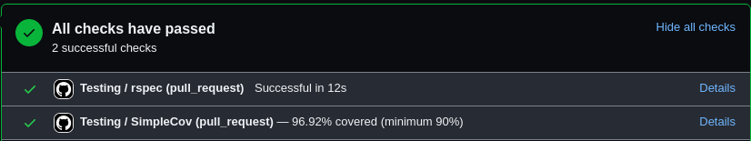
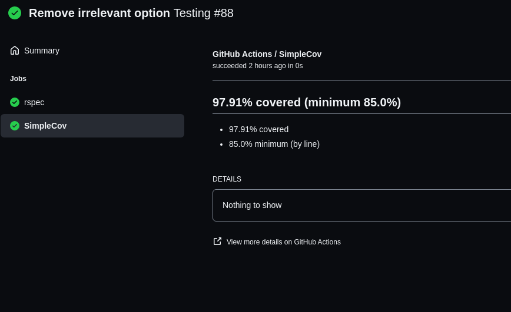
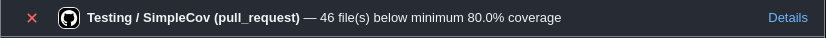
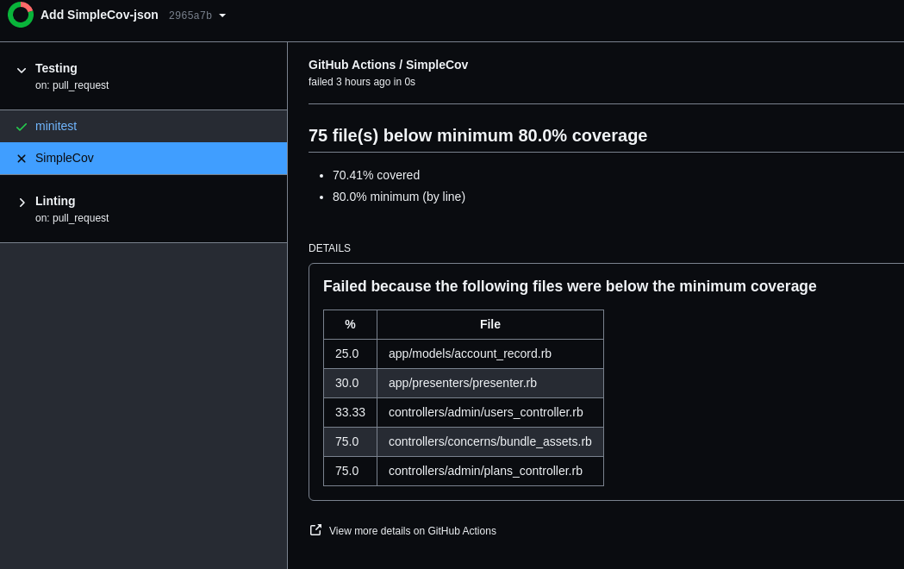

# Screenshots

Below are some basic examples you can exact while using `simplecov-check-action`

## Basic Output

**Github PR Check UI**
The PR check UI displays the coverage percentage relative to the minimum coverage threshold

**Github Detailed Check UI**
The detailed check UI displays basic coverage statistics

## Advanced Output

**Github PR Check UI**
The PR check UI displays the number of files that were below the minimum coverage threshold

**Github Detailed Check UI**
The detailed check UI displays all files which failed to surpass the minimum coverage threshold

